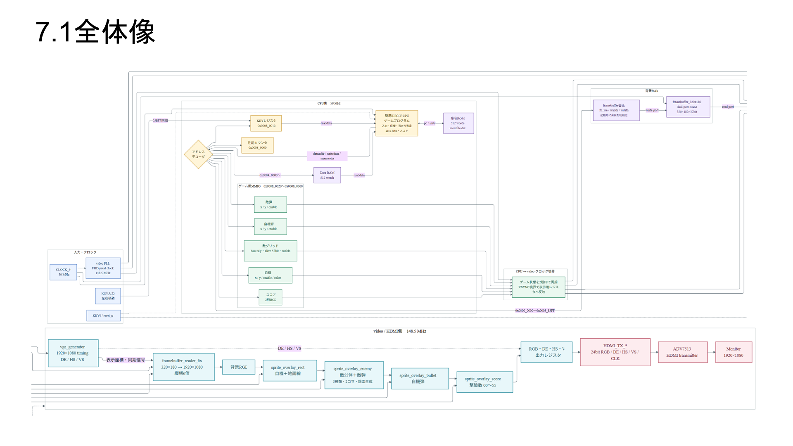
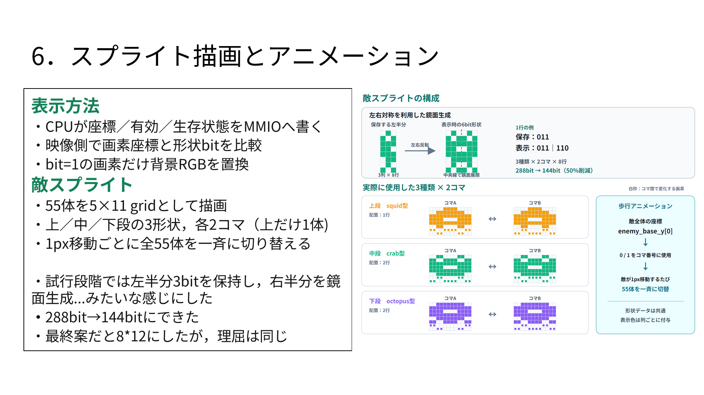

# FPGA上の簡易RISC-V CPUを用いたインベーダー風ゲーム

DE10-Nano上の簡易RV32I CPUから、HDMI映像回路とゲーム用MMIOを制御する
インベーダー風ゲームの制作物です。320×180のフレームバッファを
1920×1080へ縦横6倍で表示し、移動物体はスプライト方式で合成します。

制作者: 1w242304 濱谷康生



## 実装した内容

- RV32I CPU上で動作するゲームプログラム
- 320×180・32bit幅のデュアルポートフレームバッファ
- HDMI側での6倍拡大表示
- KEY入力による自機移動
- 自機弾・敵弾・当たり判定
- 5行×11列、合計55体の敵管理
- 3種類×2コマの敵スプライトアニメーション
- 撃破数のBCDスコア表示
- MMIOによるCPU／映像回路間の状態受け渡し
- 処理時間測定用パフォーマンスカウンタ



## 成果物

- [成果発表資料（PDF・公開版）](docs/presentation/成果発表資料_公開版.pdf)
- [成果発表資料（PowerPoint・実機動画埋込み版）](docs/presentation/成果発表資料_公開版.pptx)
- [実機動作動画（MP4）](docs/video/実機動作.mp4)
- [CPU・ゲームSoC](cpu_source/)
- [映像・スプライト回路](vpg_source/)
- [ゲームプログラム](memfile.s)
- [RV32Iアセンブラ](tools/assemble_rv32i.py)
- [MMIO一覧](docs/images/mmio-map.png)

## GitHub公開時のCPU置換について

成果発表資料では、授業で使用した `triscv` を拡張した構成として
制作内容を説明しています。一方、`triscv` のCPU実装は教科書の実装を
ベースとしているため、そのままGitHubへ掲載していません。

GitHubで成果物を公開するにあたり、資料内の `triscv` は公開可能な別の
CPUコアへ置き換えました。現在の公開ソースでは、RISC-V ISA仕様から
新規作成した[RV32Iコア](cpu_source/riscv.v)を使用しています。
ゲーム側とのインターフェースを維持しているため、映像回路、MMIO、
ゲームプログラムの構成は変更せず利用できます。

また、授業配布のアセンブラは含めず、同じ `memfile.dat` を生成できる
プロジェクト固有のアセンブラへ置き換えています。

## ファームウェアの生成

Python 3で次を実行します。

```console
python tools/assemble_rv32i.py memfile.s
```

308ワードの `memfile.dat` が生成されます。

## FPGAプロジェクトについて

本制作はTerasicのDE10-Nano HDMI公式リファレンスデザインを土台として
開発しました。公式デモ由来ファイルを含め、Quartusプロジェクト一式を
収録しています。各ファイルに記載されたTerasic／Alteraの著作権表示と
利用条件は変更せず保持しています。

Quartus Prime 25.1stdでの再構築方法は
[BUILDING.md](docs/BUILDING.md)を参照してください。

## 確認結果

- RV32Iコアの命令実行テスト: PASS
- ゲームSoC起動シミュレーション: PASS
  - フレームバッファ初期化: 57,600書込み
  - 自機・敵グリッドのMMIO初期化を確認
- 新アセンブラの出力: 従来の `memfile.dat` とSHA-256一致
- Quartus Analysis & Synthesis: 0 errors
- フル配置配線: この作業時は未完了

## 権利表示

このリポジトリにはオープンソースライセンスを設定していません。
特に許諾されたものを除き、著作権は制作者に帰属します。
第三者由来部分と権利表示については
[THIRD_PARTY_NOTICES.md](THIRD_PARTY_NOTICES.md)を参照してください。
